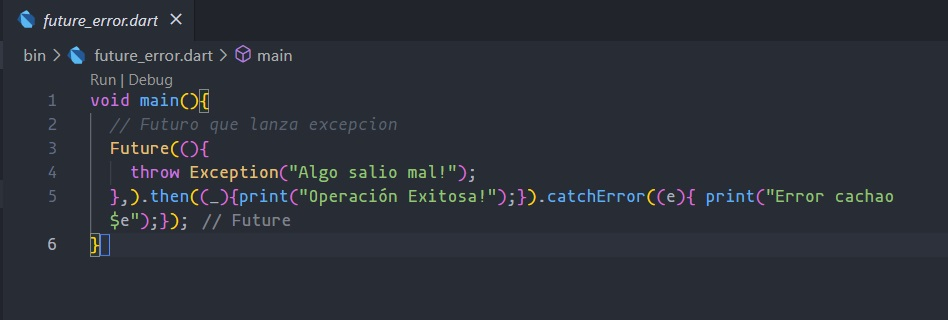
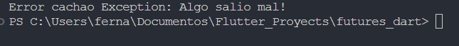

# Flutter-Ejemplos
# Mi Proyecto

## Índice
- [Ejercicios 01 al 04](#ejercicios-01-al-04)
  - [Hello World](#hello-world)
  - [Variables](#variables)
  - [Maps](#maps)
  - [List, maps and Iterables](#list-maps-and-iterables)
- [Ejercicios 05 al 08](#ejercicios-05-al-08)
  - [Functions](#functions)
  - [Classes](#classes)
  - [Constructors and names](#constructors-and-names)
  - [Get and Set](#get-and-set)
- [Ejercicios 09 al 15](#ejercicios-09-al-15)
  - [Abstract class](#abstract-class)
  - [Mixins](#mixins)
  - [Futures](#futures)
  - [Async Await](#async-await)
  - [Try catch finally](#try-catch-finally)
  - [Streams](#streams)
  - [Stream await](#stream-await)
- [Aplicación HelloWorld](#aplicación-helloworld)
- [Aplicación YesOrNo](#aplicación-yesorno)

## Ejercicios 01 al 04
### Hello World
01: Hello World. 

### Variables
02: Variables. 

### Maps
03: Maps. 

### List, maps and Iterables
04: List, maps and Iterables. 

## Ejercicios 05 al 08
### Functions
05: Functions. 

### Classes
06: Classes. 

### Constructors and names
07: Constructors and names. 

### Get and Set
08: Get and Set. 

## Ejercicios 09 al 15
### Abstract class
09: Abstract class. 

### Mixins
10: Mixins. 

### Futures
11: Futures. 

### Async Await
12: Async Await. 

### Try catch finally
13: Try catch finally. 

### Streams
14: Streams. 

### Stream await
15: Stream await. 

## Aplicación HelloWorld
Aplicación HelloWorld 

## Aplicación YesOrNo
Aplicación YesOrNo 

